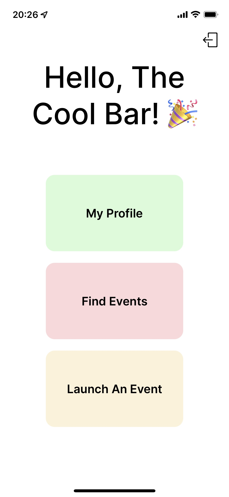
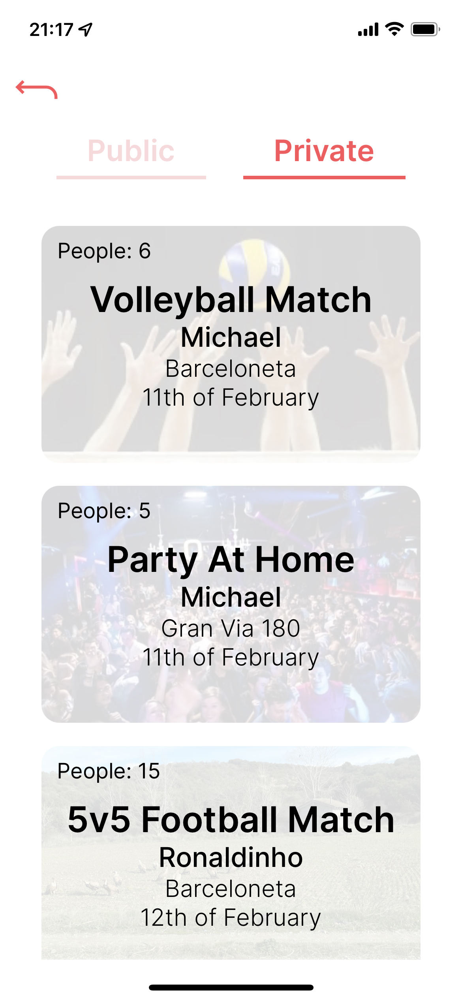

# What2Do

What2Do is an iOSs app to find and post events in Barcelona.

## User Interface

  
  &nbsp;
  
  &nbsp;
  
  &nbsp;
  

## Getting started

Requirements:

- Expo Go on your mobile phone.
- Docker installed and opened on your computer.

Open the terminal and in the root folder run the following commands:

- `npm run set-up`, to install the dependencies.
- `npm run infra:up` to set up the database.
- In one tab, `npm run start-server` to be able to use the back-end.
- In another tab, `npm run start-app` to be able to use the front-end.
  - Scan the QR code.

You should be able to use What2Do!

\* To stop the docker container run `npm run infra:down`.

## Tech Stack

- React Native (ejected from Expo).
- Express JS.
- PostgresSQL.
